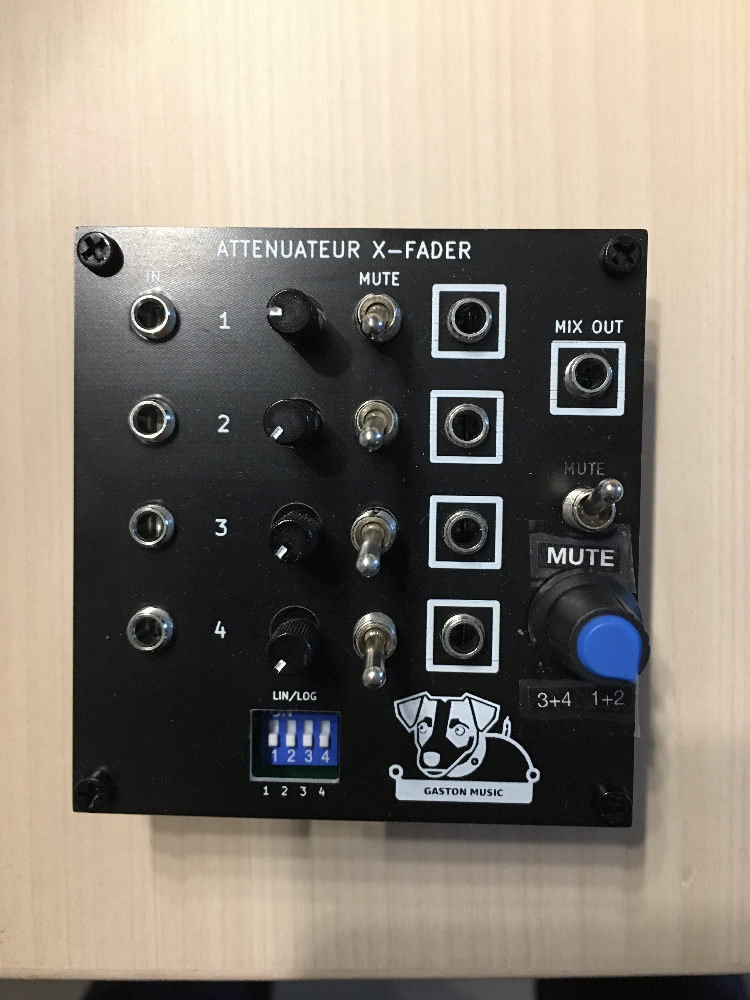

# Module-0HP-QuadAttXfade
Quadruple attenuateur passif
Testé et Fonctionnel

2 petites erreurs de cablage :
- le potentiometre Mix out que j'ai cablé à l'envers, ainsi que le bouton mute du Mix out.

  Ces erreurs ont été corrigés dans le fichier kicad, et les fichiers gerber.
  Comme je m'en suisapeçu après fabrication, j'ai juste refait une étiquette pour corriger la serigraphie.

2 small wiring errors:
- the Mix out potentiometer that I wired backwards, as well as the Mix out mute button.

   These errors have been corrected in the kicad file, and the gerber files.
   As I noticed after manufacturing, I just made a label again to correct the screen printing.

[Build document](https://htmlpreview.github.io/?https://github.com/jojo-monk/Module-0HP-QuadAttXfade/blob/main/ibom.html)
